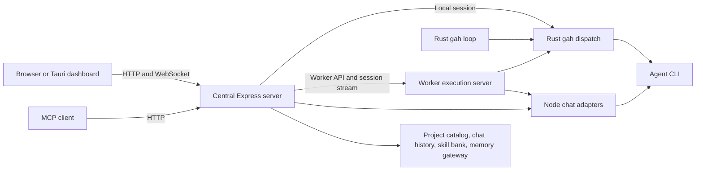

# GAH control surfaces

## Current capability inventory

This inventory answers [#794](https://github.com/Kh1ng/git-agent-harness/issues/794).
It describes source revision [2defbcd](https://github.com/Kh1ng/git-agent-harness/commit/2defbcd8ef774ee074de017490bec98bf8d533ca), reviewed on 2026-09-08.
Implemented means that the code exists at this revision. It does not mean that every operating system passed physical testing.
The tables identify the owning modules, test evidence, and remaining work.

This baseline excludes [#1146](https://github.com/Kh1ng/git-agent-harness/pull/1146) and [#1147](https://github.com/Kh1ng/git-agent-harness/pull/1147).
Those changes address installer commands/macOS CI and selected mutation safeguards respectively.
Their PR records determine their integration status. This dated inventory does not count them as baseline capabilities.

The [project brief](PROJECT_BRIEF.md) defines ledger and session artifacts as runtime evidence.
Its referenced `MANAGER_MEMORY.md` is absent from this checkout. This inventory uses tracked code and tests rather than unavailable operational notes.

### Execution and state ownership

The central server owns fleet registration, central claims, project ownership, chat history, and the master skill bank.

On macOS, `scripts/install-macos.sh` and the desktop role control share the
tracked `scripts/macos-launchd.sh` service owner. Central mode serves the same
web control surface on loopback port 3774 by default; worker mode loads one
configured profile only when the operator starts it. Switching roles unloads
the opposite LaunchAgent, so one Mac cannot silently run both contracts.
Workers expose an execution API and keep their own checkouts and runtime artifacts.
The phrase "worker has no server" in older tickets conflicts with this implemented transport.
Workers reject central administration and do not initialize central stores. The [worker contract](WORKER_ROLE.md) describes role configuration and memory access.

Rust's controller chooses local work and backend routes. The Node fleet coordinator chooses a destination for a submitted fleet session.
These are separate decisions. A running local `gah loop` does not automatically become a distributed work queue.

### Operator applications

| Application | Implemented behavior | Evidence and limits |
| --- | --- | --- |
| Tauri desktop | One app window shows the dashboard and **Settings → This computer**. The bundled Settings page saves the central address, checks tools, and controls an optional worker. | [Native commands](../apps/desktop/main.rs), [connection UI](../apps/desktop/src/main.ts), [Windows setup](WINDOWS_NODE_SETUP.md). Only the bundled Settings document has native command permissions. The native app menu’s Settings action also works when central is offline. Windows uses WSL for the worker. |
| macOS presence | Dock, tray, and launch-window preferences persist. Defaults show the tray and a window. The app preserves a way to reopen its controls and can show native alerts from the configured central dashboard. | `Presence`, the bounded notification bridge, and their tests in [main.rs](../apps/desktop/main.rs). Packaged Dock/tray and notification permission transitions still need manual verification. |
| Browser dashboard | React provides Overview, Work, Telemetry, Quota, Activity, Settings, Chat, Git, and Nodes. The same app runs in the desktop dashboard webview. | [App routing](../apps/web/src/App.tsx), [navigation tests](../apps/web/tests/component/Navigation.spec.tsx), [browser smoke tests](../apps/web/tests/e2e/smoke.spec.ts). Navigation uses React state rather than URL routes. |
| Windows/macOS packaging | CI builds native desktop artifacts, including a Windows NSIS installer. Windows installation can combine the GUI and a WSL worker. | [Desktop workflow](../.github/workflows/desktop.yml), [Windows installer](../scripts/install-windows.ps1), [WSL installer](../scripts/install-wsl-worker.sh). A successful build does not prove installation, reboot recovery, or remote reachability. |
| iOS/Android | Native control-only shells load the shared dashboard. The iPhone shell adds QR scanning and de-duplicated local activity notifications. The Android shell stores the central address and isolates external links from its WebView. | [iPhone app](../apps/ios/README.md), [Android app](../apps/android/README.md), and [mobile scoping](../apps/desktop/MOBILE_SCOPING.md). Release signing, iOS background push, and physical background/resume still need verification. |

The [manual testing procedure](testing/worker-device-manual.md) owns device verification steps.
The [UI audit](UI_AUDIT_2026-09-07.md) records accessibility and layout findings without implying native device coverage.

### Dashboard workflows

| Workflow | Current UI and behavior | Remaining boundary |
| --- | --- | --- |
| Monitor and control work | [Overview](../apps/web/src/pages/OverviewPage.tsx) shows blockers, review holds, dependency blockers, current sessions, merge requests, and loop controls. [Work](../apps/web/src/pages/WorkPage.tsx) lists sessions, tickets, reviews, and attempt history. | The Factory redesign and map view do not exist. Overview provider links support hosts without popups, with a [rendered navigation regression](../apps/web/tests/component/OverviewNavigation.spec.tsx). |
| Inspect usage and failures | [Telemetry](../apps/web/src/pages/TelemetryPage.tsx) shows reports, series, chat usage, and ticket costs. [Quota](../apps/web/src/pages/QuotaPage.tsx) shows candidate eligibility and observation age. | Complete per-account billing and outcome comparisons across every backend remain under #940. Unavailable measurements are not proof of zero usage. |
| Read activity | [Activity](../apps/web/src/pages/EventsPage.tsx) receives the high-signal controller and node-health stream over the existing WebSocket. The server persists up to 2,000 entries, replays from the client's cursor, and the client de-duplicates by event ID. | System alerts are opt-in. Browser alerts need notification permission; iPhone delivery is local while the app runs, not background APNs. |
| Manage nodes | [Nodes](../apps/web/src/pages/NodesPage.tsx) shows cached observations, age, profiles, resources, and claims. It exposes health/readiness checks and registration guidance. | An unobserved node has unknown health. Registration does not prove that a CLI is authenticated or eligible for a particular job. |
| Configure the installation | [Settings](../apps/web/src/pages/SettingsPage.tsx) exposes profiles, effective configuration, backend availability, gateway configuration, skills, update controls, and Windows node commands. The macOS app also changes the host role. | Complete versioned prompt policies remain a separate ticket. |
| Use project chat | [Chat](../apps/web/src/pages/ManagerChatPage.tsx) provides sessions, streaming replies/tools, permissions, stop/steer, models, and node selection. An authenticated Telegram bridge maps paired identities to exact profile scopes and one-time action cards. [ProjectRail](../apps/web/src/components/ProjectRail.tsx) groups projects by owner node. | Remote issue/PR-seeded sessions and remote previews remain unsupported. Telegram rejects broad approvals, non-text attachments, and remote slash commands. |
| Import repositories and inspect Git | [Project routes](../apps/server/src/projectRoutes.ts) import on a selected worker. [Git](../apps/web/src/pages/GitPage.tsx) exposes status, branches, log, commit, and PR/MR actions. | Import is not the resumable onboarding workflow in #539. Provider identity, preflights, validation, and loop enablement do not form one resumable transaction. |

GitHub and GitLab are implemented providers. Custom GitLab domains use an explicit provider, numeric project ID, and an HTTP(S) API root ending in `/api/v4`.
The [project catalog](../apps/server/src/projectCatalog.ts) validates those settings.
[Git PR/MR creation](../apps/server/src/gitPullRequest.ts) uses provider-specific commands and preserves the provider URL.
This support does not imply complete parity for every provider operation.

### Server, contracts, and fleet transport

The public server uses [Express HTTP routes](../apps/server/src/server.ts) and [WebSocket messages](../apps/server/src/wsServer.ts).
Effect packages appear in [package dependencies](../apps/server/package.json), but the active HTTP/session implementation uses Express and promises.
The [session manager](../apps/server/src/sessions/SessionManager.ts) launches real `gah dispatch` processes through [gahCli](../apps/server/src/gahCli.ts).
The [MCP server](../apps/mcp-server/src/server.ts) calls fixed HTTP operations through its client.

| Boundary | Implemented behavior | Test evidence or gap |
| --- | --- | --- |
| API authentication | Remote HTTP and WebSocket requests require accepted credentials. Local trust checks consider socket, Host, Origin, and proxy headers. Paired devices have revocable cookies. | [Server boundary tests](../apps/server/src/server.test.ts), [WebSocket tests](../apps/server/src/webSocketAuth.test.ts), [pairing tests](../apps/server/src/pairing.test.ts). The older #794 claim of universally unauthenticated mutations is obsolete. |
| Authorization | Owner-only routes protect pairing management and credential-bearing bootstrap responses. Worker routes use an explicit allowlist. | [Role tests](../apps/server/src/nodeRole.test.ts). Broad device access does not provide the complete per-operation capability, idempotency, and audit contract in #532. |
| Typed reads | HTTP exposes status, quota, doctor, reports/series, history, events, profiles, configuration projections, and PM plan queries. | The [read API audit](READ_API_AUDIT_2026-09-08.md) owns the operation-level gap list. Generated capability metadata does not generate every payload contract or guarantee HTTP availability. |
| Registration and health | The [registry](../apps/server/src/registryService.ts) stores node identities and credential references. Its scheduler caches classified health observations and publishes invalidation events. | [Registry tests](../apps/server/src/registry.test.ts), [liveness tests](../apps/server/src/registryLiveness.test.ts), [registry contract](../packages/contracts/src/registry.ts). Cached health has an observation time. |
| Fleet dispatch | [FleetDispatchCoordinator](../apps/server/src/fleetDispatch.ts) selects healthy declared nodes, supports explicit node selection, and tracks session leases. Selection considers active work, configured capacity, resource observations, availability, and model support. | [Fleet tests](../apps/server/src/fleetDispatch.test.ts) cover routing, remote streams, and lease reconciliation. No historical-throughput queue redistribution contract exists. |
| Claims | Central claim services arbitrate work identity across nodes. Rust has central-claim and fleet-preflight clients. | [Claim tests](../apps/server/src/claims.test.ts), [Rust claims](../src/central_claims.rs), [preflight](../src/fleet_preflight.rs). Central leases and local claim files represent different state. |
| Remote chat | The central retains conversation history and resolves skills. Registered workers execute turns in node-owned checkouts through a fixed worker protocol. | [Coordinator integration test](../apps/server/src/workerChatCoordinator.test.ts), [worker protocol tests](../apps/server/src/workerChatProtocol.test.ts), [remote import tests](../apps/server/src/projectRoutes.test.ts). Stale or missing worker observations cannot authorize a new remote chat turn. |

### Rust backend and policy boundaries

[BackendRunner](../src/runner/backend_runner.rs) implements dispatch for Codex, Claude, Vibe, OpenCode, OpenHands, AGY, and Hermes.
Its tests exercise each adapter's arguments. [Dispatch](../src/dispatch/attempts.rs) still constructs backend-specific run contexts.
[Review](../src/runner/review.rs) builds its own commands and supervision state. It still omits configured Vibe and OpenCode arguments.

Interactive chat uses a separate [Node adapter registry](../apps/server/src/managerChat/registry.ts).
Hermes and OpenCode use ACP. Codex and Claude use ACP bridges. Vibe and AGY use headless adapters with transcript replay.
OpenHands and Cursor are absent from this chat registry. Cursor is also absent from the Rust backend enum.
These implementations do not yet form one dispatch, review, chat, skills, plugins, and usage interface.

The [routing module](../src/routing/mod.rs) applies candidate policy, availability, approvals, and reservations.
For review routes, it can reorder equal-priority configured candidates only
after each candidate has five observed outcomes. It compares later repairs,
human merge overrides, latency, quota-backed runs, and API cost. Missing data
keeps the configured order. Paid approval and a configured-last GLM route do
not move.
The [controller](../src/controller/mod.rs) decides work from observed state.
[ExecutionIdentity](../src/execution_identity.rs) separates runner, logical backend, instance, account, quota pool, and requested/effective models.
The [migration contract](BACKEND_INSTANCE_CONFIG_MIGRATION.md) preserves legacy declarations and keeps runtime paths out of durable identity.

[Status](../src/status.rs) and [Doctor](../src/doctor.rs) use the same executable
resolver as dispatch. Readiness keeps unresolved, unobserved, and ineligible
states separate. Instance overrides merge by field over the canonical entry.

Provider issues, dependency checks, claims, attempts, review results, and publication already feed deterministic work decisions.
[PM plans](PM_PLAN_API.md) add persisted decomposition and publication dry-run operations.
The [worker contract](WORKER_ROLE.md) identifies the remaining dispatch-memory recall gap under #830.

### Gap map for the destination

| Destination | Remaining work | Tracking |
| --- | --- | --- |
| Install and manage any node | Validate Windows installation and complete native Windows execution support. | [#938](https://github.com/Kh1ng/git-agent-harness/issues/938), [#942](https://github.com/Kh1ng/git-agent-harness/issues/942) |
| One node/worker contract | Document registration, transport, lifecycle, queue semantics, and central-store ownership against the existing APIs. Complete inherited environment declarations and readiness provenance. | [#795](https://github.com/Kh1ng/git-agent-harness/issues/795), [#741](https://github.com/Kh1ng/git-agent-harness/issues/741) |
| Work distribution between computers | Reconcile Node fleet selection with Rust reservations and local loops. Define queue depth and redistribution behavior before adding another scheduler. | [#796](https://github.com/Kh1ng/git-agent-harness/issues/796), [#835](https://github.com/Kh1ng/git-agent-harness/issues/835) |
| One agent interface | Finish dispatch cleanup, fix review drift, and define the chat capability without discarding its streaming/permission behavior. Complete instance skills/plugins/usage coverage. | [#832](https://github.com/Kh1ng/git-agent-harness/issues/832), [#833](https://github.com/Kh1ng/git-agent-harness/issues/833), [#834](https://github.com/Kh1ng/git-agent-harness/issues/834), [#863](https://github.com/Kh1ng/git-agent-harness/issues/863), [#797](https://github.com/Kh1ng/git-agent-harness/issues/797) |
| Work as issues | Complete resumable repository onboarding and safe approval/recovery controls. Reorganize the existing ticket/session/review views into Factory after its configuration contract exists. | [#539](https://github.com/Kh1ng/git-agent-harness/issues/539), [#503](https://github.com/Kh1ng/git-agent-harness/issues/503), [#1076](https://github.com/Kh1ng/git-agent-harness/issues/1076) |
| Map view | Choose the map format and prototype it against real node, work, and dependency identities. No current page implements the map. | [#799](https://github.com/Kh1ng/git-agent-harness/issues/799), [#800](https://github.com/Kh1ng/git-agent-harness/issues/800), [#1077](https://github.com/Kh1ng/git-agent-harness/issues/1077) |
| Phone control | Complete authenticated reconnect, PWA behavior, and native packaging. Test device-specific interactions and background/resume. | [#529](https://github.com/Kh1ng/git-agent-harness/issues/529), [#534](https://github.com/Kh1ng/git-agent-harness/issues/534), [#526](https://github.com/Kh1ng/git-agent-harness/issues/526), [#936](https://github.com/Kh1ng/git-agent-harness/issues/936), [#798](https://github.com/Kh1ng/git-agent-harness/issues/798) |
| Safe operational parity | Complete generated read contracts, capability checks, mutation audit/idempotency, and discoverable policy-aware controls. Complete HTTPS onboarding and billing attribution. | [#519](https://github.com/Kh1ng/git-agent-harness/issues/519), [#532](https://github.com/Kh1ng/git-agent-harness/issues/532), [#517](https://github.com/Kh1ng/git-agent-harness/issues/517), [#943](https://github.com/Kh1ng/git-agent-harness/issues/943), [#940](https://github.com/Kh1ng/git-agent-harness/issues/940) |

This inventory consolidates ownership and gaps. It does not replace the detailed API audit, worker contract, or testing procedure.

## Device requirements

The owner confirmed these requirements on 2026-09-07.

| Surface | Manage the central node | Execute repository work |
| --- | --- | --- |
| Browser | Yes | Through registered workers |
| Windows Tauri app | Yes | Optional WSL worker on the same computer |
| iOS app | Yes | No |
| Android app | Yes | No |

Mobile control surfaces reuse the central dashboard and authenticated connections.
They do not install workers, repositories, Rust, Node, or agent CLIs.
Windows requires a native desktop experience. Its worker can use WSL for Linux tools.
Native Windows execution remains a separate compatibility requirement.

## Pair a browser or remote Tauri dashboard

1. Open the central dashboard with owner access. Select **Pair a device** below the access-token control.
2. Enter the central address that the other device can reach. Do not use localhost for another device.
3. Select **Generate pairing code**. The code expires after five minutes and works once.
4. Scan the QR with the device's camera, or open the displayed pairing link manually.
5. Check the server name, address, server ID, and requested access against the owner screen.
6. Enter a device name and select **Confirm server and pair**.
7. The browser receives a separate 30-day device session. Owner access can list and revoke each device individually.

The QR contains the server address, server ID, and pairing code in a URL fragment.
It contains no coordinator token, GitHub credential, or worker installation command.
The confirmation screen removes the fragment from browser history. Codes never enter HTTP query strings.
Expired, redeemed, wrong-server, and pre-restart codes cannot issue another credential.
Cancelling confirmation does not issue a credential. A copied unused code still grants access until expiry or redemption.

**Pair this device** also provides **Open a pairing link** for manual entry when scanning is unavailable.
A link for another server opens that address before confirmation. App builds contain no fixed LAN or Tailscale address.
This implementation uses the operating system's camera/link handling; it does not request camera permissions itself.

## Access and storage

A paired device gets broad dashboard access: projects, chat, agent work, and settings.
This is a trusted control surface, not a sandbox or a restricted capability role.
Pairing management and credential-bearing node/gateway bootstrap responses require owner access.
Existing backend policy still applies to work. Fine-grained capability scopes remain part of #532.

The browser stores its credential in a host-only, HttpOnly, SameSite=Strict cookie.
It persists across reloads and browser sessions until expiry, logout, or owner revocation.
JavaScript receives device metadata, never the credential. Cookies must be enabled.
The same cookie authenticates HTTP and WebSocket connections at that server origin.
Cookie requests require exact browser origin checks; bearer clients retain their existing transport policy.

The central stores only SHA-256 credential hashes and device metadata in `config/paired-devices.json`.
Use `GAH_DEVICE_STORE_PATH` to choose another path. Atomic replacements use file mode `0600`.
Use one central server process per device store. Protect its directory and backups as administrative state.
Pending codes exist only in process memory. Restarting central invalidates those codes while retaining paired devices.

Revocation rejects subsequent HTTP requests and upgrades, closes the device's existing sockets,
and rejects buffered WebSocket messages before dispatch. It does not cancel work already accepted.
A revoked or expired supplied cookie cannot fall back to local or trusted-LAN access.
Direct loopback access without credentials remains an owner access path under the existing local trust policy.

Use HTTPS through the existing local proxy or secure tunnel. Named server origins must appear in `GAH_WS_ALLOWED_ORIGINS`.
With the explicit `GAH_ALLOW_INSECURE_HTTP=1` setting, pairing can use trusted LAN HTTP.
That mode issues a non-Secure cookie so browsers can actually use it, and confirmation displays the transport warning.
HTTP exposes the cookie to the transport and other services on the same host; use HTTPS outside a trusted deployment.
Proxy logs must omit pairing request bodies and credential headers, including `Cookie`, `Set-Cookie`, `Authorization`, and `Sec-WebSocket-Protocol`.

## Pairing API

| Request | Authority | Result |
| --- | --- | --- |
| `POST /api/pairing/offers` with `origin` | Owner | Versioned offer, code, expiry, server identity, access description |
| `POST /api/pairing/inspect` with `code`, `server_id` | Pending code + same-origin transport | Confirmation details without consuming the code |
| `POST /api/pairing/redeem` with `code`, `server_id`, `name`, `confirm: true` | Pending code + same-origin transport | Device metadata and an HttpOnly session cookie |
| `GET /api/pairing/session` | Authenticated owner/device | Current principal kind and device ID when paired |
| `GET /api/pairing/devices` | Owner | Device metadata; never credential hashes or values |
| `DELETE /api/pairing/devices/:id` | Owner | Immediate credential revocation |
| `POST /api/pairing/logout` | Same-origin transport | Removes this browser's cookie |

Only inspect, redeem, and cookie clearing precede the common API authentication guard.
Pairing routes are unavailable on workers. Responses are not cached; requests are rate-limited.
The shared contract lives in `packages/contracts/src/pairing.ts`.

## Test boundaries

Automated tests cover real HTTP and WebSocket authentication, single-use codes, expiry,
restart invalidation, wrong server/origin, hash-only storage, owner restrictions, and live revocation.
A browser regression covers confirmation, QR/manual links, cookie persistence and attributes,
replay rejection, and a revoked live connection using mock dashboard data with production authentication.

Native iOS scanning, platform keychains, installed webview cookie persistence,
and physical devices are not claimed as tested. Validate iOS and Android separately.
Browser viewport tests do not prove native builds or device behavior.

For physical testing, check camera refusal and manual entry, expired/replayed codes,
wrong servers, revoked credentials, unavailable networks, and browser/app relaunch.
Then check keyboard layout, chat streaming, background/resume, and Wi-Fi/cellular reconnection.
The existing iOS handoff starts with Safari validation; keep it independent from Windows worker installation.
