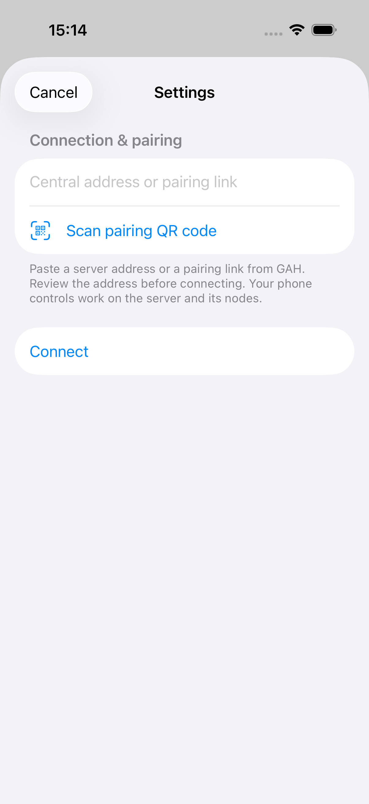

# Unconfigured iPhone connection form

Date: 2026-10-03. iPhone 17 Pro simulator.

The first-launch XCTest overrides saved address restoration with an empty origin. It opens **Set up connection** and verifies that the address field has an empty value. The screenshot was inspected and contains no deployment address, node name, or SSH user.



```text
ControllerTests.testFirstLaunchOffersAnEmptyConnectionForm passed
Executed 1 test, with 0 failures
TEST SUCCEEDED
```

The full local fixture suite also passed: 7 tests, 1 live-central check skipped, 0 failures. The helper checks passed for a missing result bundle and failed screenshot exports after both failed and successful XCTest runs.

This evidence covers the simulator and test helper. Physical acceptance remains open in issue #936.
