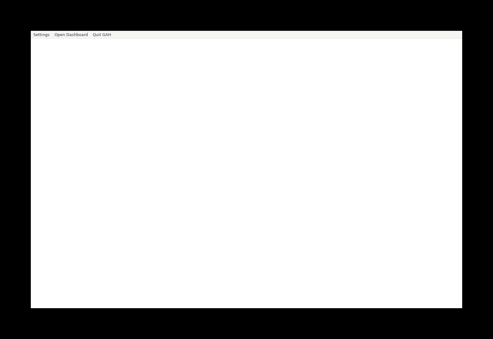

# Fresh Linux release and setup audit

Date: 2026-10-03. Release tested: v0.1.3.

The supplied Linux tester transcript was read in full. It is not committed because it contains the tester's identity and authentication output. Public evidence below uses a fresh test account and generic paths.

## Findings from the tester transcript

| Finding | Tracking | Evidence and limits |
| --- | --- | --- |
| Factory installation is not presented as a separate module choice | #1317 | Loop and maintenance units are installed; the watchdog remains disabled. Installing a unit is not the same as enabling a running factory. Module semantics need to distinguish these states. |
| Standalone networking is not separated from central setup | #1318 | Setup offers Tailscale as optional and permits declining it, but the installer later tells the user to join a tailnet. The transcript does not prove Tailscale caused the final failure. |
| Memory setup requires an inappropriate model key | #1319 | CLI setup and both platform installers unconditionally require the colocated gateway's model API key. Ollama/TDAI provider configuration needs verification and correction. |
| Desktop onboarding hands work to a terminal | #1320 | Existing standalone action opens a terminal and accepts setup defaults. There is no complete in-app choice/progress/recovery flow. |
| Normal installation builds from source | #1321 | The transcript builds the CLI twice and builds the server/web UI. Bootstrap also builds from source, despite release artifacts being available. |
| Server service assumes a developer's installation | #1322 | Tracked system unit hardcodes its user, checkout, config, Node binary and PATH. Both install and update copy it verbatim. The tester's service journal was not supplied, so its exact systemd failure code remains unknown. |
| Unsupported Node runtime is accepted | #1323 | Setup accepts Node 20.20.1; npm then reports that Claude ACP 0.70.0 requires Node >=22. The log does not demonstrate a subsequent chat failure. |
| GitHub auth detection contradicts successful login | #1324 | Setup initially says logged out after a successful login; a later attempt says logged in. Raw status-probe results are absent, so the cause remains unconfirmed. |

The `gh issue list` failure was caused by running outside a repository. An interrupted login command and Rust toolchain-override warning do not independently demonstrate new application defects.

## Release checks

The published Linux CLI ran in a clean Ubuntu 24.04 container. The container had no Cargo, npm, Node, gh, glab or Tailscale. Its setup report still treats Cargo and Node as required and offers source-toolchain installation.

`gah --version` exited 2 with `unexpected argument '--version' found`. This is tracked in #1325.

The AppImage was extracted on native x86_64 Linux. The only GAH executable found was `usr/bin/gah-desktop`; the bundle had no `gah`, Node executable, or server `bin.js`. This confirms the complete local runtime is missing from the release package (#1321).

In a separate native Linux Ubuntu container, the extracted application launched under Xvfb as a fresh non-root account. Cargo, npm, Node, gh, glab and Tailscale were absent. The desktop process remained alive, and X11 reported its GAH window. This verifies shell launch, not successful standalone setup or working chat/dispatch.

The tracked system unit was checked against a clean Linux environment. Its configured service user, working directory and Node executable were all unavailable. This confirms that its defaults are not portable; it does not replace running the corrected service on a fresh Linux account.

The AppImage initially failed to execute through Docker's x86_64 emulation on an ARM host. It extracted and launched on native x86_64 Linux, so the emulation failure is not being filed as a product defect. Headless-container portal/FUSE/graphics warnings are likewise not attributed to the tester's setup failure.

## GUI content check failed

The screenshot showed a blank document behind the native menu. Repeating with `WEBKIT_DISABLE_DMABUF_RENDERER=1`, `LIBGL_ALWAYS_SOFTWARE=1` and a larger Xvfb display still showed blank content. Accessibility inspection exposed the native menu but no setup document. This is tracked in #1326.

The same extracted artifact was also launched on native Linux outside Docker, under Xvfb with isolated XDG config/data directories and software rendering. That screenshot also showed blank content. This additional check isolates the application configuration; it is not a fresh operating-system installation.

Both environments are headless. These checks do not prove the same symptom on an interactive Linux desktop, and no confirmed application cause is claimed yet. Process termination after the capture was intentional. No real authentication, factory dispatch or installed system-service changes were performed.

The [container check](container-check.sh) and [accessibility probe](accessibility.py) record the smoke-test method. Mount the published AppImage as `/artifacts/release.AppImage`, the accessibility probe as `/artifacts/accessibility.py`, and an empty writable proof directory as `/proofs`; run the container check in Ubuntu 24.04 on native x86_64. This test installs desktop test dependencies inside the temporary container, not application build tools. The [results](results.json) record artifact hashes and the observed checks.

The complete standalone application is **not validated as ready**. The runtime packaging, GUI onboarding, service portability and optional-module defects remain open. PR #1316 addresses repository CLI guidance only.
