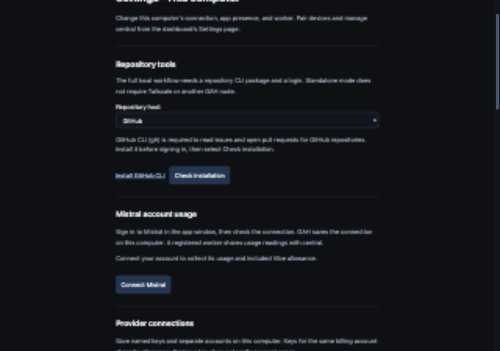
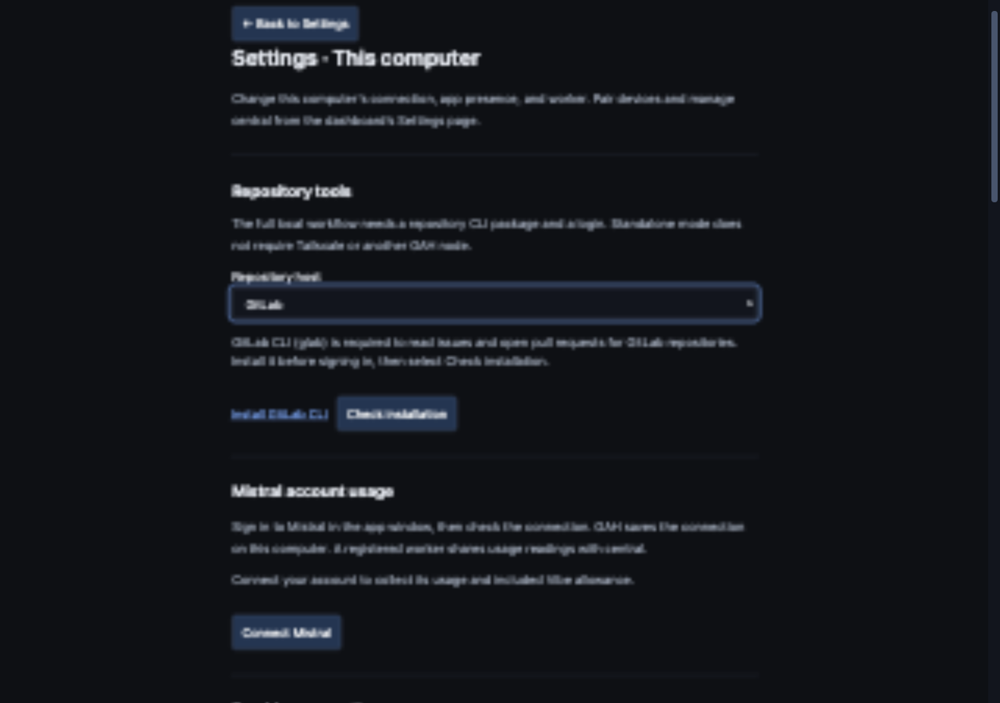

# Standalone repository CLI prerequisites

Date: 2026-10-03.

The desktop Settings UI was manually inspected in the collaborative browser at 1280 × 900. The native bridge was mocked to reproduce a new Linux installation without repository CLI packages. No real login, credential change, or package installation was performed.

The GitHub state explained that `gh` is required before authentication. Selecting **Install GitHub CLI** sent `https://cli.github.com/` to the native external-link command. After the fixture reported `gh` installed, **Check installation** showed the package as installed and removed the install link. It explicitly kept authentication separate.

Selecting GitLab showed its own package requirement and official installation guide.

The branch's actual login-repair module was bundled and executed on Linux with an empty executable path. Both repository CLIs returned `install_required`; no OAuth request was made. The isolated script was removed afterward. The Linux process result is in [linux-check.json](linux-check.json).

Automated checks:

- Desktop Settings regression: missing package, official guide link, installed re-check, and GitLab selection passed.
- Both login-panel component checks passed.
- All 13 login-repair tests passed, including missing packages before OAuth and preserving token transport on stdin after a successful package check.
- Full serial all-feature Rust suite: 2,331 passed across 36 test binaries; formatting and Clippy passed.
- Full server/mock suites: 617 passed, 1 skipped, 0 failures.
- Root and desktop type checks passed.
- Native desktop tests: 35 passed. The macOS desktop application bundle built successfully.

This run does not prove a fresh Linux AppImage installation. Linux validation covers the real login-repair process and the GUI with a mocked native bridge.
